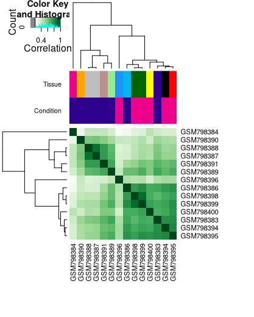
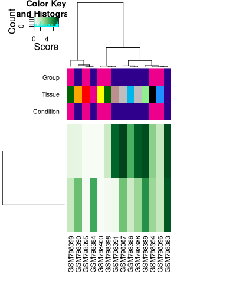
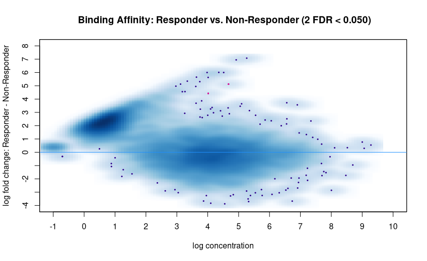
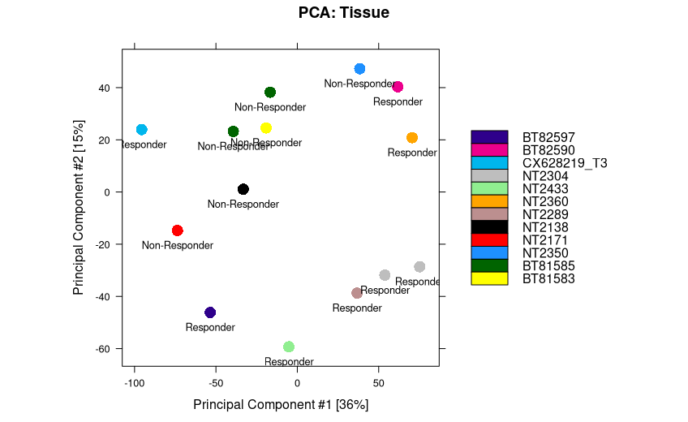

```{r setup, include=FALSE}
knitr::opts_chunk$set(echo = TRUE)
```

## The Process

We begin with a csv file, which I have as *labelled_2.csv*, Here you can see the columns this file contains:

```{r, eval=TRUE}
samples <- read.csv("/home/matthew/Documents/BSPIData/labelled_2.csv")
names(samples)
```

It is important to note that there are not 62 samples in this file. There are 15 samples, all of which are from human tumor tissues, as I have ignored cell line samples here. Then each sample has it's corresponding input file called as a control. *MACS* peakcalling was used to obtain these peaks. 

We now turn to *DiffBind*, the version of which used here is 2.16.0. The work presented here is very derivative of the Vignette of the *DiffBind* package, although naturally the analysis presented later on will not be.

We start by calling DiffBind, and reading in the CSV as above:

```{r, eval=FALSE}
library(DiffBind)
samples <- read.csv("/home/matthew/Documents/BSPIData/labelled_2.csv")
```

Next up we read in the peaksets using the DBA function, which then gives us a DBA object:

```{r,eval=FALSE}
samples_dba <- dba(sampleSheet = "/home/matthew/Documents/BSPIData/labelled_2.csv")
```

Great, we now have a DBA object, so what next? We now use the dba.count function to calculate a binding matrix, the scores of which are based on the read counts of each sample not the condifence scores. Note the *summits* parameter, which, when set to 250 gives peaks of 500bp. 

```{r, eval=FALSE}
samples_count <- dba.count(samples_dba, summits=250, bParallel=FALSE)
```

Note *bParallel* is used here to turn of parallel processing, this allows R to output messages as it runs through, which is naturally quite helpful to know the function is running as expected, and not just crashing my computer.

Next we need to run the *dba.contrast* function so that DiffBind knows which samples fall into which groups. There are two groups, stored in the *Condition* section of the CSV. Each sample is either a **Responder** or **Non-Responder**.

```{r,eval=FALSE}
samples_contrast <- dba.contrast(samples_count, categories=DBA_CONDITION)
```

Finally, we come to the differential analysis, which for us, looks like:

```{r, eval=FALSE}
samples_analyze <- dba.analyze(samples_contrast)
```

This function runs a *DESeq2* analysis, by utilising the default binding matrix. But this isn't the end just yet, we now need to obtain the differentially bound sites, which is done by:

```{r, eval=FALSE}
samples.DB <- dba.report(samples_analyze)
```

## The Plots

We first see the heatmap generated by the contrast of the samples:

{scale=0.6}

This heatmap shows correlation in the samples. Although not done here, if you change the *score* parameter when plotting this heatmap, it will show you the effect of different scoring methods. The next graph we produce shows us the patterns of binding affinity, neatly referred to as a *binding affinity hetmap*.

{scale=0.4}

On the rows of the above, we have the affinities and clustering of the differentially bound sites. The next graph is an MA plot, which are handy for showsing which datapoints are identified as being differentially bound. 



Each point on this plot is a binding site, with red ones being those that are differentially bound. It is hard to see on this graph but there are only 2 identified as being differentially bound, these are in the middle and towards the top. 

The final plot we will see here is a PCA plot, this is great for showing clustering in the samples, and is a bit easier to see that clustering in our case than on a heatmap.

{h}

We can see here there is some clear clustering in the bottom left, with NT2304 and NT2289 tissues that are all responders, and in the top moddle, where BT81585 samples and a BT81583 sample, all non-responders are clustered together. 

## Discussion

These plots give us a great deal of information about our data, which is great, but I am slightly worried that there are only 2 differentially bound sites. I am also concerned that in the affinity heatmap, there are only two rows, as in most examples, there are hundreds. For example, in the DiffBind vignette, their *tamoxifen.DB*, identified 629 differentially bound sites, but as mentioned we only have 2. I don't know if this is a bad reflection on our data, or if they purposfully chose data with a large number of sites in order to best present the DiffBind package's capabilities. 

But all in all, I am pleased to see clustering of similar tissues, and I am happy with the results that DiffBind produced. 